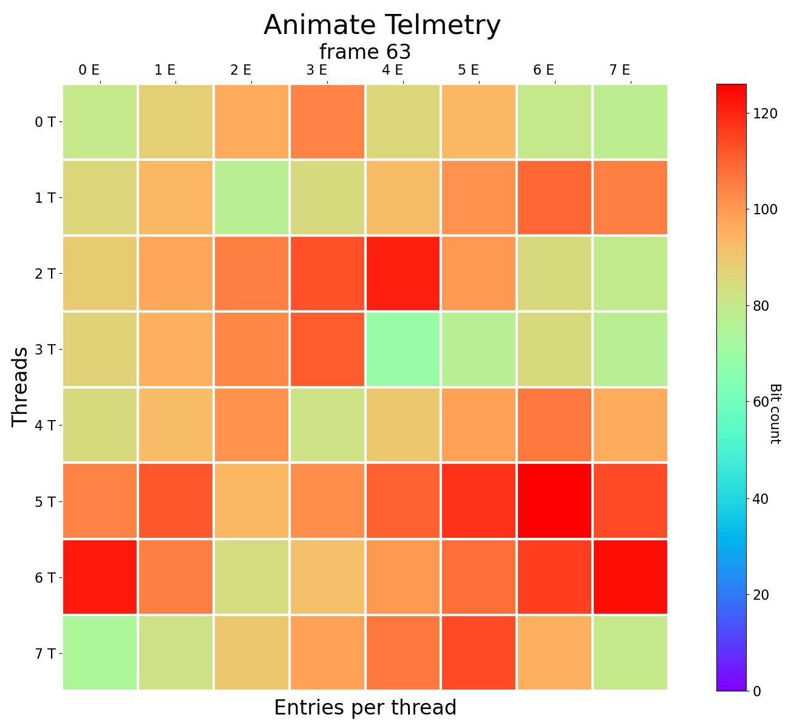
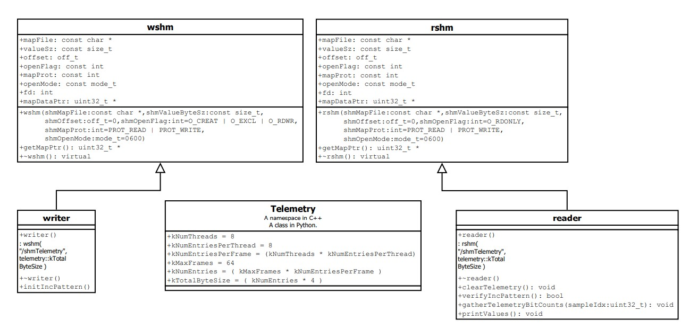
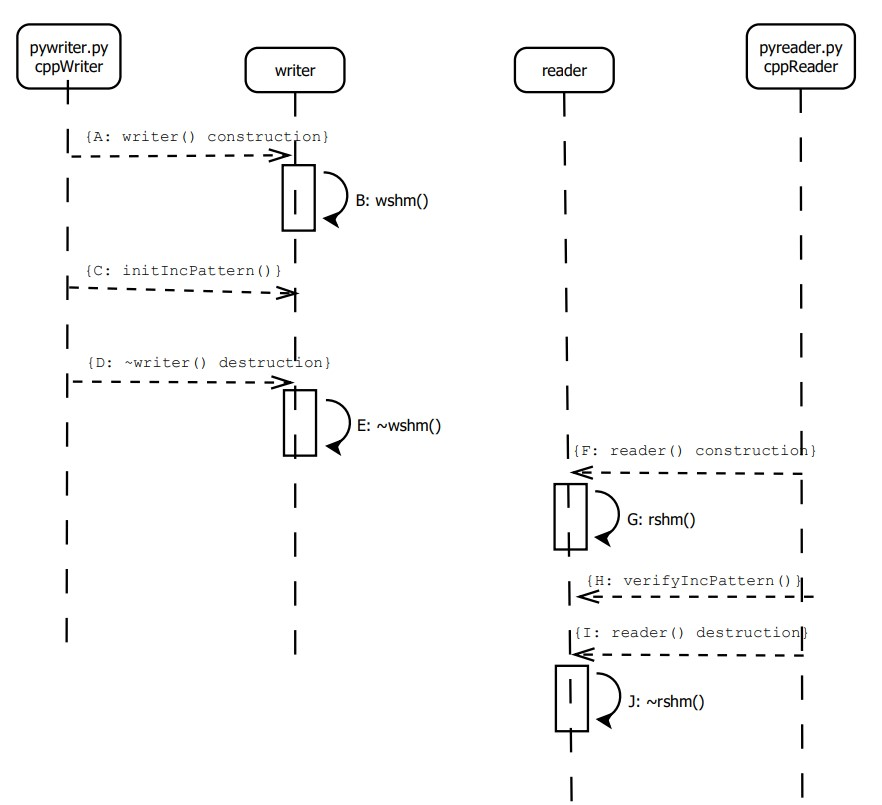
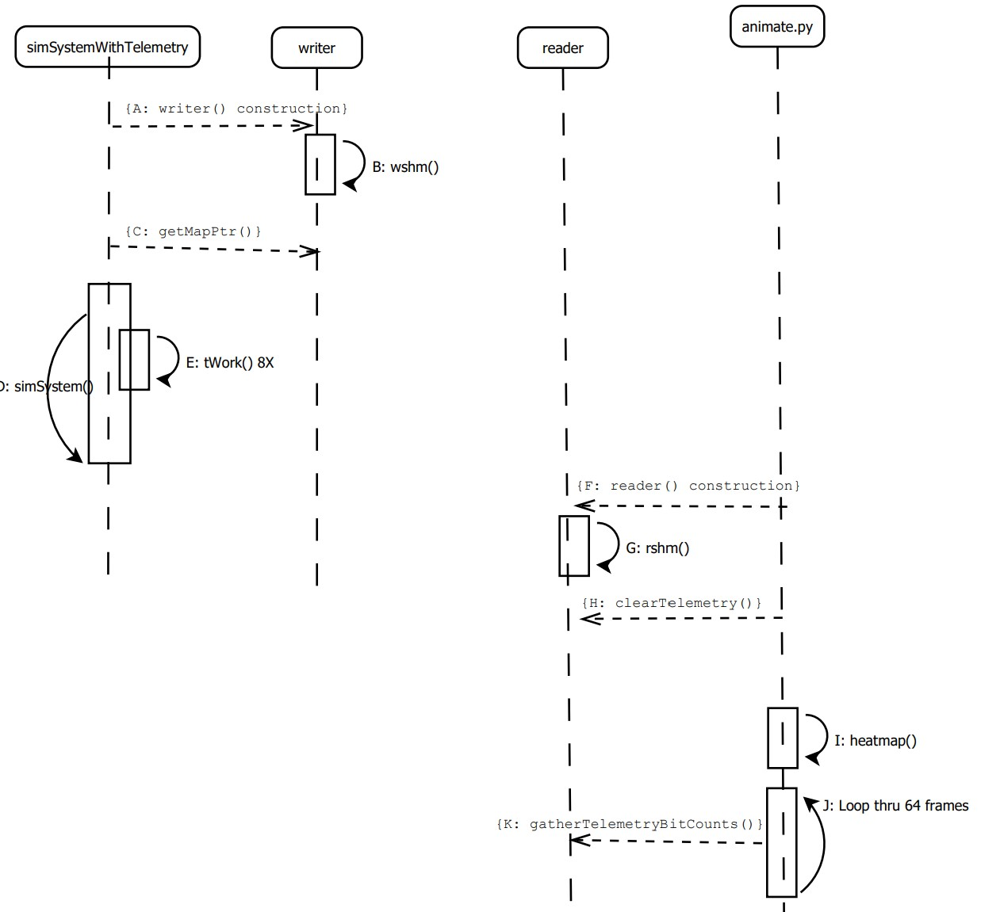

<header>

<!--
  <<< Author notes
-->

# GitHub Page for displaying Heatmaps of telemetry data with cpp + python via shared memory.

10/19/23 This software is currently tested with ubuntu.

</header>

<!--
  <<< Author notes
-->
## Author
Andrew Louder
## What is telemetry?
Telemetry automatically collects, transmits and measures data from ***remote sources***,
using sensors and other devices to collect data. 
It uses communication systems to transmit the data back to a ***central location***. 
Subsequently, the data is ***analyzed*** to ***monitor*** and control the remote system.
## A use case of telemetry to help visualize.
Consider we want a system to look for heat lost of your home furnace.  A infrared camera could watch the furnace.
A laptop could be connected via ethernet to the camera to display heatmaps.
* The ***remote source*** would be the infrared camera.
* The ***central location*** would be shared memory on the laptop.
* The ***monitor*** could be a cpp program that utilizes ethernet to control the camera and writes
data to shared memory.
* Python could be utilized to displaying animated heatmaps: ***analysis*** by reading
shared memory.  Each frame(sample) in the animation is a still camera shot of color indicating heat.    
## This project has been tested under ubuntu.
The ***remote source*** in this case is a python/cpp programs running on ubuntu that write to shared memory rather than a device.
The ***central location*** is shared memory where this project provides examples how to mix python and cpp.
The ***analysis*** is done by a python program to read shared memory to display an animated heatmap.
### Example remote system: "simSystemWithTelemetry"
Telemetry is raw data that we want to visualize to better understand its meaning.
* Samples are taken at a periodic rate to animate and thus observe changes.
The "simSystemWithTelemetry" is an imaginary system with telemetry data.
* There are 8 threads with 8 entryies per thread, thus 64 32-bit entries per sample(frame).
* There are a total of 64 samples(frames) taken.
* To generate a color we count the #'s of 1's(bits) in the 32-bit entry, thus color will increase over time as the 1's are increased.
### Example heatmap
The example heatmap below is telemetry data for the 64th frame of "simSystemWithTelemetry".

## UML class diagram
This diagram is cpp centric syntax, but the same attributes and methods are modeled in python.

* wshm == Write shared memory.
The constructor is convenient to default shared memory attributes except filename and size.
* rshm == Read shared memory.
The constructor is convenient to default shared memory attributes except filename and size.
* Telemetry == Grouping of constants describing the telemetry data structure.
In c++ these constants are in a namespace, while in a class for python.
* writer == A wshm generalization using Telemetry constants.
This class is utilized in test programs pywriter.py and cppWriter for testing an incrementing pattern.
This class is utilized in simSystemWithTelemety for bit counts of telemetry data.
* reader == A rshm generalization using Telemetry constants.
This class is utilized in test programs pyreader.py and cppReader for testing an incrementing pattern.
This class is utilized in animate.py for displaying heatmaps.
## Test shared memory sequence diagram.

* A) Writer construction.
    Note cppWriter/pywriter.py programs will fail if the shared memory has already been created.
	Thus running cppWriter/pywriter.cpp two times in a row will fail.
* E) ~wshm() destructor.
    Note the cppwriter/pywriter.py programs will terminate with the shared memory written.
    Note python code required: "resource_tracker.unregister(self.shm._name, 'shared_memory')" statement.	
* F) Reader construction.
    Note cppReader/pyreader.py will fail if the shared memory has not been written.
	Thus running cppReader/pyreader.py two times in a row will fail.
* J) ~rshm() destructor.
    Note the shared memory is unlinked, thus removed.
## simSystemWithTelemetry sequence diagram including animation.

* D: simSystem()
   Start 8 threads of execution.  Each thread will have a single row of 8 entries per frame.
* E: tWork()
   Bits are set in the telemetry at different rates, so the heatmap will have different colors.   
* J: Loop thru 64 frames.
   This loop will compute bit counts and update the heatmap thru matplolib library.
   Matplotlib details can be referenced here: [heatmap](https://matplotlib.org/stable/gallery/images_contours_and_fields/image_annotated_heatmap.html
)
## Python documentation
The doxygen generated HTML is best viewed by first downloading this github project.
.../HeatmapTelemetryCppPyMashup/py/html/index.html
.../HeatmapTelemetryCppPyMashup/cpp/QtSln/utilLib/html/index.html
.../HeatmapTelemetryCppPyMashup/cpp/QtSln/cppWriter/html/index.html
.../HeatmapTelemetryCppPyMashup/cpp/QtSln/cppReader/html/index.html
.../HeatmapTelemetryCppPyMashup/cpp/QtSln/simSystemWithTelemetry/html/index.html
## Descriptive videos.
1) First we got see an animated heatmap.
   Later we will review "simSystemWithTelemetry" on how it writes to shared memory.
2) Review and execute the python and cpp programs for testing shared memory.
3) Review the "simSystemWithTelemetry" cpp code.
4) Review the animate python code.

<footer>

<!--
  <<< Author notes: Footer >>>
-->

---

</footer>
